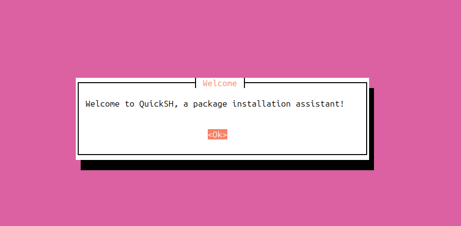

<h1 align="center">
    QuickSH
</h1>

<p align="center">
    
    
    
</p>

<p align="center">
    
</p>

A shell script to automate the installation of packages and tools in Ubuntu.

## Usage

```bash
$ git clone https://github.com/mxrera/quick-sh.git
$ cd quick-sh
$ ./install.sh
```

## Packages available

- [`brave`](https://brave.com/linux/): browser
- [`gimp`](https://www.gimp.org/): image editor
- [`inkscape`](https://inkscape.org/): vector graphics editor
- [`vlc`](https://www.videolan.org/vlc/download-ubuntu.html): media player
- [`audacity`](https://www.audacityteam.org/): audio editor
- [`obs-studio`](https://obsproject.com/): screen recorder
- [`obsidian`](https://obsidian.md/): note-taking app
- [`spotify`](https://www.spotify.com/us/download/linux/): music player
- [`discord`](https://discord.com/): chat
- [`anydesk`](https://anydesk.com): remote desktop
- [`net-tools`](https://packages.ubuntu.com/search?keywords=net-tools): network tools
- [`docker`](https://docs.docker.com/engine/install/ubuntu/): container tool
- [`vscode`](https://code.visualstudio.com/): code editor
- [`neovim`](https://neovim.io/): code editor
- [`tmux`](https://github.com/tmux/tmux/wiki): terminal multiplexer
- [`pip`](https://pip.pypa.io/en/stable/): python package manager
- [`nodejs`](https://nodejs.org/en): javascript runtime
- [`npm`](https://www.npmjs.com/): nodejs package manager
- [`foxglove-studio`](https://foxglove.dev/download): robotics visualization tool
- [`wireshark`](https://www.wireshark.org/): network protocol analyzer
- [`neofetch`](https://github.com/dylanaraps/neofetch): system information
- [`tree`](https://linux.die.net/man/1/tree): directory tree
- [`xclip`](https://linux.die.net/man/1/xclip): clipboard manager
- [`netcat`](https://linux.die.net/man/1/nc): network utility
- [`tcpdump`](https://www.tcpdump.org/): network packet analyzer
- [`iputils`](https://manpages.debian.org/stretch/iputils-ping/ping.8.en.html): network utility
